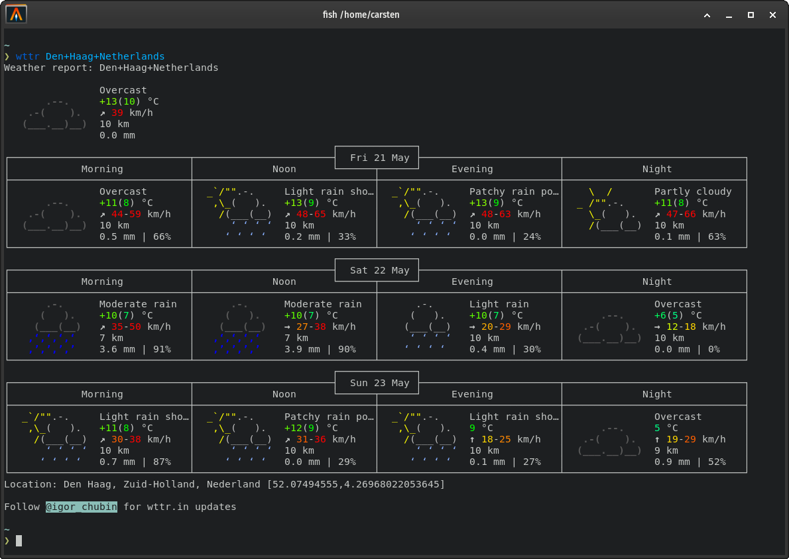

# wttr

A Bash script to check weather condition via terminal created by Carsten Brueggenolte.

Current Version: **1.53_2021-09-02**



## Thanks Amirreza Firoozi

for trusting me in maintaing this repo as best as I can! (https://github.com/AmirrezaFiroozi/wttr)

## Installation 

The installer will install the script into the directory `$HOME/.local/bin/` of the current user. Please check the `installer.sh` before you execute it!

```bash
$ cd /tmp
$ git clone https://github.com/cblte/bash-script-wttr
$ cd bash-script-wttr
$ bash installer.sh
```

## Usage 

The `wttr` script comes with some parameters explained below

The following arguments are available:

```bash
    # get weather report for a city
    wttr cologne
    wttr "Den Haag, Netherlands"

    # get another, different weather report display
    wttr -v2 cologne
    wttr -v2 "Den Haag, Netherlands"

    # get another, different weather report display
    wttr -v3 cologne
    wttr -v3 "Den Haag, Netherlands"

    # install curl which is necessary for script to run correctly
    # currently it only works on systems with 'apt' installed 
    wttr -i 
    
    # set a city as your default city.
    # without a second argument, wttr will ask you for input
    wttr -sdef
    
    # set Den Haag as default city
    wttr -sdef "Den Haag, Netherlands"
    
    # get todays forecast or the current weather only
    wttr -t
    wttr -n
    
    # see a photo of the Moon
    wttr -m

    # uninstall and remove the wttr script
    wttr -rm
    
    # show the script version
    wttr -v
    
    # show the help screen
    wttr -h
```

## License

This program is free software; you can redistribute it and/or modify it under the terms of the GNU General Public License as published by the Free Software Foundation

## Credit 

goes to Amirreza Firoozi for the initial script and some other people he also mentioned in his code: Jadi , Alireza Amirsamimi & Mostafa Asadi, doc-ock. 

Thanks you guys!
